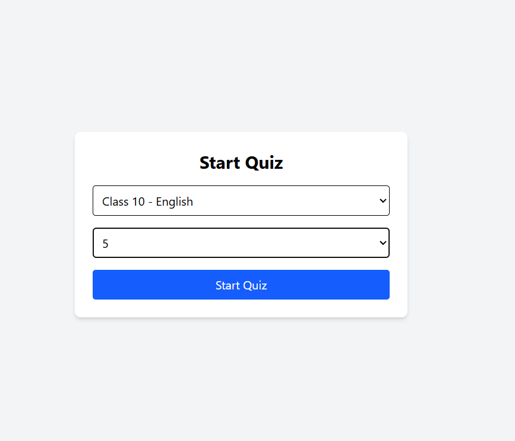
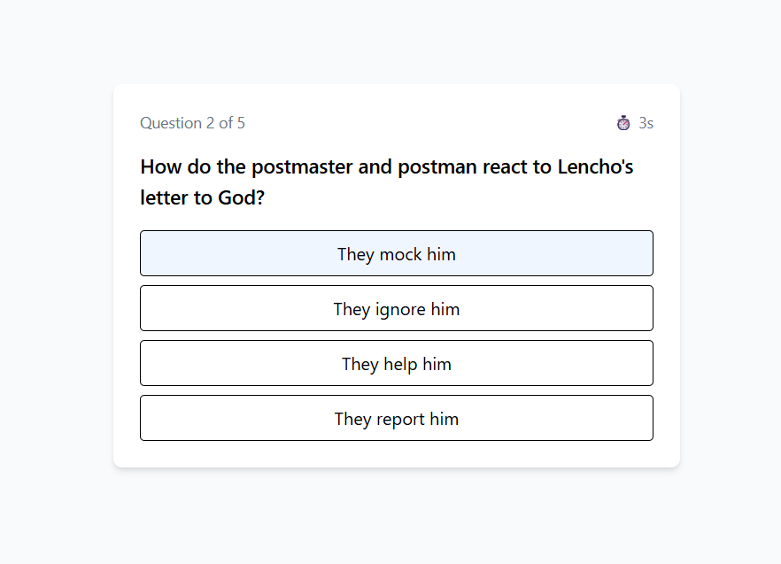
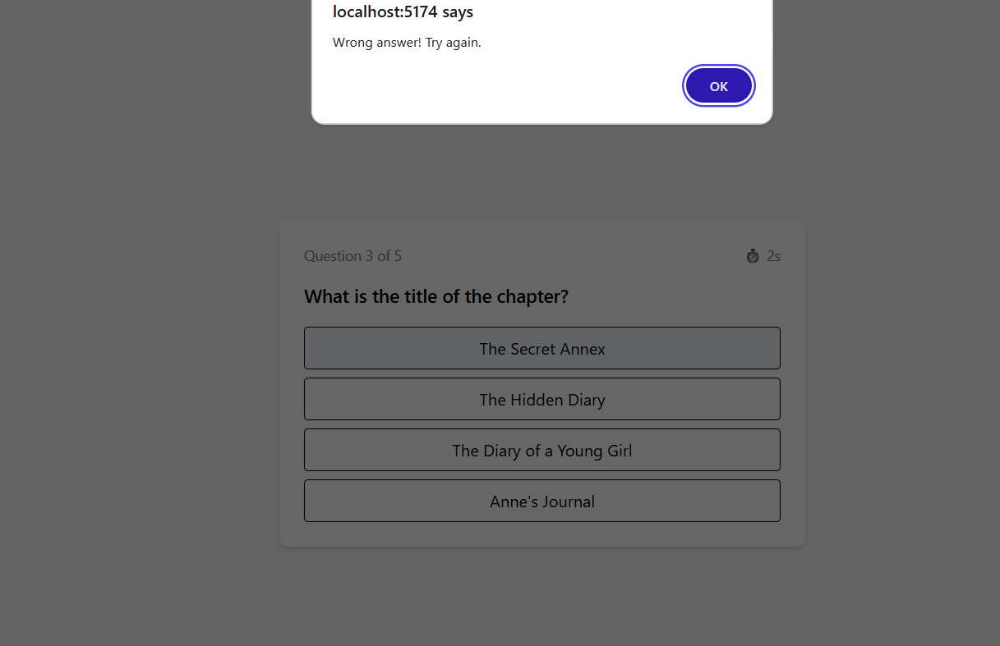
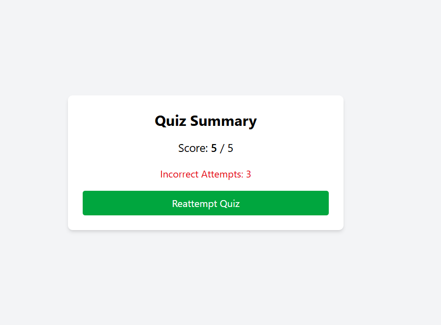

# 🧠 Edzy Hackathon – Quiz Application (Frontend)

An interactive **Quiz Application** built using **React + Vite + Tailwind CSS**, developed as part of the **Edzy Frontend Hackathon**.  
The app allows students to select a subject, attempt quizzes question-by-question, retry until correct, track progress, and view a detailed summary at the end.

---

## 🖼️ Preview

---

## 🚀 Live Features

- ✅ Subject selection (Class 10 – English, Math, Science, Social Science)
- ✅ Dynamic quiz fetching from Edzy API
- ✅ One question at a time
- ✅ Retry until the correct answer is selected
- ✅ Per-question timer
- ✅ Progress indicator (Question X of Y)
- ✅ Final score summary
- ✅ Incorrect attempt tracking
- ✅ Reattempt quiz option
- ✅ Mobile-responsive UI (Tailwind CSS)

---

## 🛠 Tech Stack

- **Frontend:** React.js (Vite)
- **Styling:** Tailwind CSS
- **API Client:** Axios
- **State Management:** React Hooks
- **Build Tool:** Vite

---

## 📁 Project Structure

